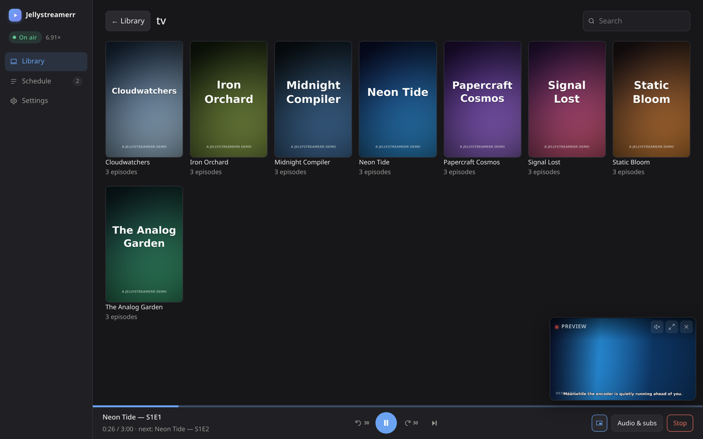
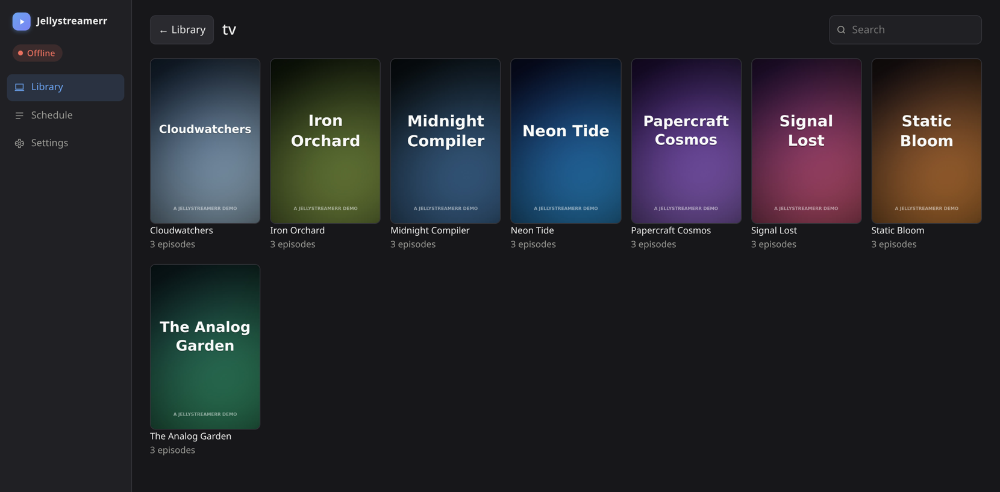
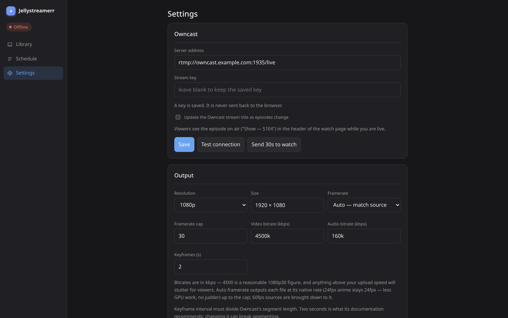
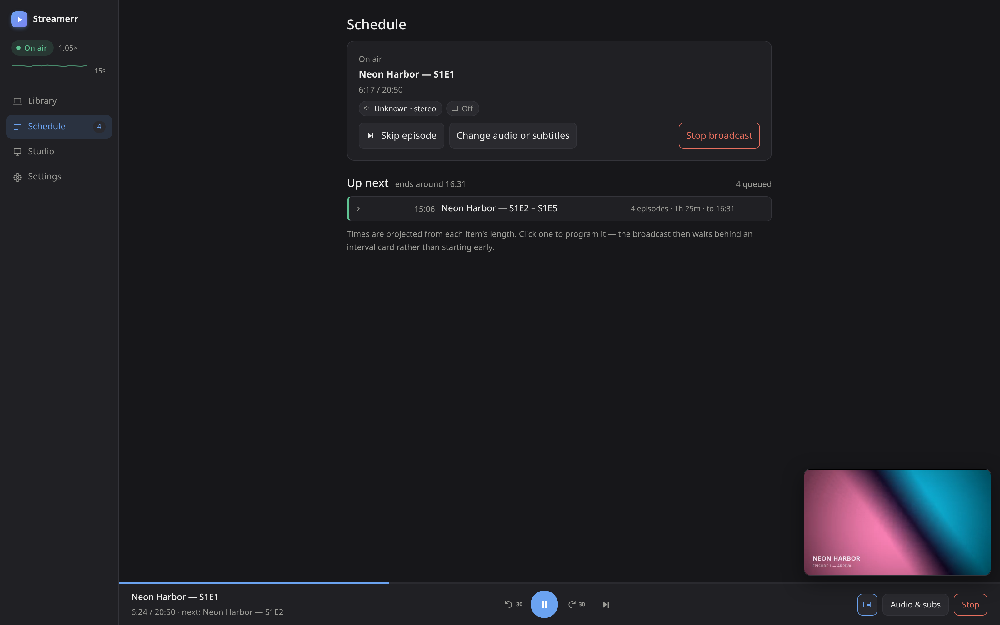

# Jellystreamerr

[](LICENSE.md)

**Turn your media library into a live TV channel.** Jellystreamerr is
web-controlled playout for [Owncast](https://owncast.online): browse your
library in the browser, click an episode, and it goes live — subtitles burned
in, the right dub selected, the rest of the season following automatically.

Runs headless in Docker. No OBS, no desktop, no capture card.

```
your library  →  Jellystreamerr  →  Owncast  →  viewers
 (any format)     (one clean stream)
```



<p align="center">
  
  
</p>

*On air: the encoder sprinting ahead at 6.9× (top left), the cache band growing
along the timeline, and the floating preview showing exactly what viewers get —
subtitles already burned in. Every title in these shots is generated demo
content.*

Owncast is our choice, not a requirement — the output is one standard RTMP
stream (H.264 + AAC), so **any RTMP ingest works**: MediaMTX, nginx-rtmp,
even Twitch or YouTube. Only the Owncast extras (title sync, the *Send 30s to
watch* test link) are Owncast-specific.

**Contents:** [What it's for](#what-its-for) · [Quick start](#quick-start-docker)
· [Owncast setup](#owncast-setup)
· [Hardware and encoders](#hardware-and-encoders) · [How it works](#how-it-works)
· [Scheduling](#scheduling) · [Subtitles and audio](#subtitles-and-audio)
· [Performance](#performance)
· [Library providers](#library-providers) · [Settings](#settings)
· [Troubleshooting](#troubleshooting) · [CLI](#cli) · [Security](#security)
· [Limitations](#limitations) · [From source](#run-from-source)
· [License](#license)

## What it's for

Owncast broadcasts **one flat video stream**. It has no track selector, no
subtitle menu, and no per-viewer transcoding — whatever you send is exactly
what everybody sees. A media library, meanwhile, agrees on nothing: 4K HEVC
10-bit HDR remuxes, 1080p H.264 web releases, 1440×1080 4:3 broadcast rips,
DTS and PCM and AAC, ASS subtitles and DVD subpictures.

Jellystreamerr sits between those two facts. It takes a heterogeneous library
and emits **one unbroken stream that never changes shape**, with the right
subtitle and audio track chosen per file the way a media server would, and
burned into the picture because that's the only thing the player can show.

While you broadcast, the panel shows a **floating live preview** — a small
draggable window playing the exact stream Owncast is receiving, seconds ahead
of your viewers. It taps the already-encoded output on its way out, so it
costs the server no additional encoding work; pin it to any corner, resize
it, or turn it off in Settings.

### Why it has to transcode

A reasonable question is why not just copy the file through untouched — plenty
of streaming setups do. It isn't available here, and **each of these alone is
disqualifying**:

- **Subtitles.** Owncast has no soft-subtitle support, so subtitles have to be
  painted into the picture — and painting anything into the picture means
  re-encoding it.
- **Mixed sources.** A continuous stream needs constant parameters across clip
  boundaries. Copying a 4K HDR remux and then a 4:3 HDTV rip into one stream
  breaks players at every transition.
- **Codec support.** RTMP carries H.264 + AAC. An HEVC remux with PCM 5.1 audio
  can't traverse that link at all.
- **Bitrate.** A 50 Mbps UHD remux is not something you push to viewers.
- **Keyframes.** HLS cuts segments on keyframes; Owncast wants one every two
  seconds. Source files typically have them every five to ten.

So transcoding isn't overhead that could be switched off — it's the price of
admission. The engineering effort went into making it *cheap enough to run
live*, which is what the GPU paths below are about.

### Why the receiver lives on a VPS

Jellystreamerr runs at home, next to the media. Owncast runs on a cheap VPS.
That split is the point: your home connection carries **one** outgoing stream
no matter how many people watch — the VPS's bandwidth fans it out to the
viewers. Five viewers pulling directly from a home upload line would kill it;
one stream to a VPS doesn't.

## Quick start (Docker)

Needs only Docker. The image bundles ffmpeg 9, every VAAPI driver, and the
pre-built web UI — nothing to install on the host.

**1. Clone and enter the repo:**

```bash
git clone <repo-url> jellystreamerr
cd jellystreamerr
```

**2. Point it at your media.** Edit `docker-compose.yml`:

```yaml
services:
  jellystreamerr:
    build: .
    container_name: jellystreamerr
    restart: unless-stopped
    ports:
      - "8099:8099"                 # web UI

    shm_size: "2gb"                 # RAM for the run-ahead cache — see below

    devices:
      - /dev/dri/renderD128:/dev/dri/renderD128   # hardware encoding

    group_add:
      - "989"                       # NUMERIC gid of the render group — see below

    environment:
      - JELLYSTREAMERR_CONFIG=/config/config.json
      # - JELLYSTREAMERR_TRUST_PROXY=1   # only behind a reverse proxy

    volumes:
      - ./config:/config            # settings + your stream key
      - ./cache:/app/cache          # extracted subtitles and fonts
      - /extHdd:/extHdd:ro          # your media, READ-ONLY — see path note
```

**3. Get the render group id right.** On the host:

```bash
stat -c '%g' /dev/dri/renderD128
```

Put that number in `group_add`, quoted. It must be the numeric gid as the
*host* sees it — the image is a different distro, so the group *name* will not
match and doesn't need to. If `privileged: true` appears to fix a permission
problem, this value is wrong; fix the number instead.

**Why `shm_size`:** the run-ahead cache keeps encoded-ahead video in RAM
(`/dev/shm`). Docker's default 64MB disables it — it never falls back to disk.
The engine sizes its budget to the container's memory on its own; `2gb` is a
safe value.

**4. Build and start:**

```bash
docker compose up -d --build
```

**5. Open `http://<host>:8099`.** The first screen makes you choose a password —
the panel can start broadcasts and holds your stream key, so it refuses to do
anything until it has one. Then an onboarding wizard walks through five
validating steps:

1. **Owncast** — RTMP address and stream key, from your Owncast admin page.
   There's a *Send 30s to watch* button so you can confirm video actually
   arrives, not just that the key was accepted.
2. **Encoder** — probed by real test encodes; pick one or leave it automatic.
3. **Library** — Jellyfin (URL + API key) or a folder, with a directory browser.
4. **Paths** — only if Jellyfin reports paths this container can't open.
5. **Languages** — preferred audio and subtitle behaviour.

Nothing needs editing by hand; everything is stored in `/config/config.json`.

### Path note (important)

The container must be able to **open the files at the paths the library
reports**. With Jellyfin that means either mounting your media at the same path
Jellyfin uses, or setting a path mapping in Settings (there's a *Check paths*
button that tells you whether every reported path is readable).

Mount it **read-only** — this service never writes to your library.

### Running inside an LXC

If Docker itself runs in an unprivileged LXC, the container needs the render
device passed through to the LXC first, in `/etc/pve/lxc/<id>.conf`:

```
dev0: /dev/dri/renderD128,gid=104,mode=0666
```

Restart with `pct stop <id> && pct start <id>` — rebooting from inside does not
re-read the config.

## Owncast setup

On the VPS, in this order:

1. **Install Owncast** — [their quickstart](https://owncast.online/quickstart/)
   is a one-liner or a small compose file.
2. **Log into the admin** at `http://<vps>:8080/admin` and change the default
   admin password.
3. **Set a stream key** under *Configuration → Server Setup → Stream Keys*.
4. **Enable video passthrough** under *Configuration → Video → Stream output*:
   edit the output entry, open *Advanced*, turn on *Video passthrough*.
   Jellystreamerr already sends stream-ready H.264 + AAC with 2-second
   keyframes — without passthrough the VPS re-encodes it for nothing. Leave
   the segment/latency defaults.
5. **Optional, for title sync**: create an access token under
   *Integrations* and put it with the server URL into Jellystreamerr's
   Owncast settings. The watch page then shows what's playing.
6. **Network**: RTMP sends the stream key in plaintext. Keep port 1935 closed
   to the internet and send the stream over a VPN or tailnet; only the watch
   page (HTTP/S) is public.

Then run the Jellystreamerr wizard — step 1 asks for the RTMP address and the
key from step 3, and its *Send 30s to watch* button confirms video actually
arrives.

## Hardware and encoders

The encoder is **never assumed**. At startup each backend is tried in order and
tested with a real 15-frame encode:

```
vaapi → qsv → nvenc → amf → videotoolbox → x264
```

This matters because `ffmpeg -encoders` lists what the binary was *compiled*
with, not what the hardware can do — a machine can advertise five H.264
encoders and successfully run two.

| Hardware | Result |
|---|---|
| **Intel** (iGPU, any generation) | VAAPI via iHD or i965, auto-selected |
| **AMD** | VAAPI via Mesa |
| **NVIDIA** | falls back to **software x264** — the image has no NVIDIA userspace libraries, so using NVENC needs `nvidia-container-toolkit` and compose changes |
| **Anything else** | software x264 — works, but likely below realtime for subtitled 1080p |

The image installs *every* VAAPI driver and deliberately never sets
`LIBVA_DRIVER_NAME`; libva probes the device and picks correctly. Forcing a
value is how an image ends up working on one vendor's hardware and silently
failing on another.

Driver behaviour is probed too, not assumed — see
[Subtitles and audio](#subtitles-and-audio).

## How it works

Owncast accepts **one publisher** and ends the broadcast after ten seconds of
socket silence. So the process that holds the RTMP connection must never
restart — but seeking, pausing, changing tracks and advancing episodes all
need a new ffmpeg. The engine splits those jobs:

```
┌─ source (restartable) ────────┐        ┌─ publisher (immortal) ─┐
│ decode → filter → encode → TS │──pipe──│ copy → FLV → RTMP      │
│ seek / tracks / pause here    │        │ holds the connection   │
└───────────────────────────────┘        └────────────────────────┘
```

The publisher runs `-c copy` and paces the whole pipeline with `-re`. Sources
come and go beneath it; `-output_ts_offset` continues each one's timestamps
from where the last stopped, so the FLV muxer never sees the timeline jump
backwards. The publisher's stdin is never closed when a source exits, or it
would see EOF and end the broadcast we're protecting.

**Between them sits a bounded elastic buffer** (~15 seconds at your bitrate).
Encode speed is not constant — subtitle rendering is single-threaded, so a clip
can swing scene by scene — and without a buffer every dip starved the publisher
directly. Fast sections now bank reserve that slow sections spend. User actions
(seek, pause, track change, skip) discard it so controls stay instant, and the
playhead rewinds to what viewers actually saw rather than what had been
encoded.

That last detail is why a mid-episode subtitle change is seamless: the new
encoder resumes at the *aired* position, not the encoder's position, so nothing
is skipped or repeated.

### The run-ahead cache

On CPU-encoded content the encoders keep working ahead of the broadcast, and
the finished video is held in RAM. The panel shows that cushion as a band
around the playhead: seeks inside it are **instant**, in both directions, and
pause/resume re-encodes nothing. A spinner chip in the corner shows whenever
the cache is building.

RAM-only by design — never disk (see `shm_size` in the quick start). Settings
has an on/off toggle and a size override; by default the budget fits itself to
the container's memory.

## Scheduling

The Schedule page turns the queue into a programme:



- Queue episodes or whole seasons; air times are projected from each item's
  real length and grouped by show.
- **Pin a block to a clock time** — the broadcast waits behind an interval
  card instead of starting early, or goes off air for the gap if you prefer.
- Skip the current episode, reorder the queue, or change audio and subtitles
  live, all without touching the stream.

## Subtitles and audio

**Tracks are chosen per file, not once per broadcast.** Track indices are
per-file — "audio track 8" on a web release means something entirely different
on the Bluray of the next episode, or doesn't exist. Selection is re-resolved
against each clip's own streams, and a live switch is remembered as a
**language and mode** rather than an index, so "Japanese dub, English subs"
follows a queue across mixed releases.

**Text subtitles** (ASS/SSA/SRT) are rendered by libass and composited. Where
the driver allows it the composite happens on the GPU, with the CPU doing only
the glyph rendering. Positioned subtitles are rendered at the video's *content
rectangle*, so a 4:3 episode in a 16:9 frame keeps its typesetting where the
author put it instead of smearing toward the pillarbox bars.

**Bitmap subtitles** (PGS/VobSub) carry source-frame pixel coordinates, so they
are composited at native size *before* scaling.

**Subtitles are extracted to a cache before their first broadcast.** Burning
them straight from the container makes ffmpeg demux the whole file a second
time during playback — measured 24% slower on remuxes, and on very large files
it prevents the encoder producing a frame at all. The first broadcast of a file
shows a *Preparing* state while this happens once; every later one starts
instantly. Extraction for upcoming episodes runs in the background during the
current one.

**Driver quirks are measured, not assumed.** Compositing subtitles onto
pillarboxed video has several possible filtergraph shapes, and which ones work
is driver-specific — on Intel iHD some fail outright, and on Mesa some encode
happily while rendering *green* bars. At startup each candidate is run for one
frame and checked **by pixel**, and the first shape that both encodes and puts
the right colours in the right places is used. If none work, subtitles burn on
the CPU, which every driver can do. If the GPU composite fails live anyway, the
engine demotes that clip to CPU and retries rather than dropping the broadcast.

## Performance

Measured on an **Intel N100**, 4K HDR HEVC and 1080p sources → 1080p output:

| Content | Speed |
|---|---|
| 4K HDR remux, no subtitles | **4.3–4.5×** |
| 1080p + subtitles, first play (reading subs from the file) | **1.25×** |
| 1080p + subtitles, cached | **1.37×** |
| 1080p + subtitles, CPU burn-in fallback | **~1.05×** |
| QSV instead of VAAPI | **2.7×** — slower; question closed by measurement |

Anything at or above 1.0× streams comfortably. The number shown in the panel is
a rolling 30-second average of real encode rate; in steady state it sits near
1.0× **by design**, because the publisher paces output at realtime and
backpressure throttles the encoder. Sustained *below* 1.0× is the problem case,
and the panel warns before the stream stalls.

Two settings are machine-dependent enough that guessing is worse than
measuring — `parallelChunks` helped 3.5× on one machine and *hurt* on another.
Run `cli.js benchmark <a typical file>` once per host and set them from that.

**Quality note:** output is H.264 at your configured bitrate (12 Mbps is a
sane 1080p figure — well above what streaming services use). Better codecs
exist — HEVC is ~40% more efficient, AV1 more still — but RTMP carries H.264,
and browser playback of the alternatives is inconsistent. At 12 Mbps the codec
is not the limiting factor; the hardware encoder's lower efficiency per bit is
comfortably absorbed. If quality ever looks lacking, raise the bitrate.

## Library providers

You can add **as many sources as you like, in any combination** — Jellyfin for
the shows, a folder for a music-video set, an SMB share for the rest. Each
gets a name, and the library page shows them all together with a chip per
source to filter down to one.

**Jellyfin** — the preferred source: posters, seasons, titles and episode
order come from the metadata Jellyfin already scraped. Create a key under
*Dashboard → API Keys*. The other providers play files just as well — they
simply lack the visual metadata.

**A folder** — no Jellyfin needed. Point it at a directory and it reads the
layout:

- Recurses into `Season NN/` subfolders.
- Titles films from their **folder** name, since the filename is a release
  string (`Backrooms 2026 2160p WEB-DL DDP5 1 Atmos DV HDR H 265-BYNDR` is not
  a title).
- Strips release tags from episode titles, falling back to `Episode 12` when
  nothing meaningful survives.
- A root holding *collections* rather than titles (`media/` containing `movies/`
  and `tv/`) is split into one library per collection, so titles land on the
  poster grid instead of the word "movies".
- Posters come from `poster.jpg` / `folder.jpg` beside the media if present.
- Episodes with no artwork of their own can have a still taken from the
  video, so a folder library does not look bare beside a Jellyfin one. Made
  on first view and cached; the frame is chosen from a window rather than
  grabbed at a fixed offset, which is what avoids fades and title cards.
  On by default for a local folder (a fifth of a second each), off for SMB
  and Jellyfin, and set per source — each one in a mixed library decides for
  itself.

Durations aren't shown in folder mode — probing every file would make browsing
crawl.

**An SMB share** — a NAS share, spoken directly: no mount, no extra container
privileges. Guest (passwordless) shares work out of the box, and you choose
the folder *inside* the share, since the share root is rarely where the media
is. One caveat: the **first** playback of each file is slower than local disk,
because subtitle extraction reads it once in full over the network. After
that it starts as fast as local media.

There is also `smbmount`, a kernel-mount variant for shares the built-in
client can't handle. It needs privileges (`SYS_ADMIN` in Docker, or
`--features mount=cifs` on a Proxmox LXC) — prefer plain `smb`.

### Picking up new media

Folder and SMB sources are read live, so a new file is there the moment you
reload. **Jellyfin is different**: it serves what its own last scan found, so
a file it hasn't scanned yet is invisible to us too.

So there is a **Refresh** button on the library page — it asks every Jellyfin
source to rescan, then reloads the shelves. The same thing runs automatically
**every 12 hours**; the interval is adjustable and can be switched off in
*Settings → Automatic library scan*. Safe to use mid-broadcast: a scan is
Jellyfin's own background work and never touches what is playing.

## Settings

Everything the wizard configures is editable later, grouped in the UI:

| Group | Covers |
|---|---|
| **Owncast** | RTMP address, stream key, connection test, 30s watch test |
| **Output** | resolution, scaling, framerate, bitrates, keyframe interval, encoder, render device &mdash; each a list of the usual answers, with Custom for anything else |
| **Library** | any number of sources — Jellyfin, folder, SMB — with a directory browser |
| **Path mapping** | only when Jellyfin's paths differ from this container's |
| **Languages** | pick the languages you understand, original vs dubbed, subtitle policy |
| **Run-ahead cache** | on/off, RAM budget (auto-recommended from the machine) |
| **Live preview** | the floating preview window (on by default) |
| **Automatic library scan** | on/off and how often (12 hours by default) |
| **Library display** | load artwork lazily — for libraries large enough that a whole shelf at once is the greater cost |
| **Developer** | read-only log console |

**Framerate** defaults to *auto*: each file is output at its own rate up to your
cap, so 23.976fps anime stays 23.976 rather than being padded to 30 — less GPU
work, no judder.

**Scaling** decides how the picture sits inside that resolution, which is
a limit rather than a target in every mode but *Always*. The default sends each file at its own size,
scaled down only when it exceeds the limit — a 640&times;480 episode goes out at
640&times;480 rather than paying five times the pixels for detail it does not
have, which the viewer's player would add for free anyway. The cost is that
the frame size is fixed for one connection, so moving between clips of
different shapes reconnects the stream; within a series that never happens.
*Always &lt;resolution&gt;* is the setting for anyone who would rather never
reconnect, at the price of encoding black bars.

**Keyframes** must divide Owncast's segment length. Two seconds is what its
documentation recommends; changing it can break segmenting.

## Troubleshooting

- **"Owncast would not accept the stream — Connection timed out."** TCP connects
  but the 1537-byte RTMP handshake is black-holed. Almost always an MTU problem
  on the path, not a wrong stream key. If you're routing over a tunnel, confirm
  large packets survive: `ping -M do -s 1300 <owncast-host>`.
- **The panel says it's playing but Owncast shows nothing.** The encoder is
  producing and the publisher isn't accepting. Most often the clip has **no
  audio track** — an audio index that doesn't exist in that file makes ffmpeg
  emit video only, and the publisher blocks forever waiting for audio it was
  configured to mux. The log signature is the output size frozen while
  `frame=` keeps climbing. The engine now fails loudly after 20 seconds of this
  rather than pretending to stream.
- **Owncast keeps showing the *previous* programme, goes offline, loops.** An
  orphaned publisher from an earlier broadcast is still holding the connection —
  Owncast accepts only one. Restart the service; current builds hard-stop the
  old publisher before starting a new broadcast.
- **A 4:3 episode plays but subtitled 4:3 dies instantly** with
  `h264_vaapi ... error code: -22`. Your driver can't do the pillarboxed GPU
  composite. Expected behaviour is that the startup probe catches this and the
  clip burns on the CPU instead; check the console for the
  `pillarbox+subtitle graph` line to see what was chosen.
- **First broadcast of a big file sits in *Preparing* for minutes.** Normal —
  it's the one-time subtitle extraction, which reads the file once. It's cached
  afterwards, and the progress bar tracks it.
- **Log says "run-ahead cache off: /dev/shm too small".** Docker's default shm
  is 64MB. Set `shm_size: "2gb"` in your compose file. The cache never uses
  disk instead.
- **Speed sits below 1.0× on subtitled content.** Subtitle rendering is
  single-threaded; heavy typesetting is the expensive case. Run
  `cli.js benchmark <that file>` — if the *no-subtitles* number is also poor,
  subtitles aren't your bottleneck.
- **The panel shows "Lost connection to Jellystreamerr".** The server isn't
  answering. Check `docker compose logs jellystreamerr` — unhandled faults are
  logged with a stack trace rather than taking the process down.
- **"The server address must start with rtmp:// or rtmps://".** Only those two
  schemes are accepted. ffmpeg takes its output protocol from the URL, so any
  other scheme would make it write somewhere instead of streaming.
- **Everything works but the timeline and preview are frozen**, while page
  reloads still show the right state. That is the WebSocket being refused —
  see [Behind a reverse proxy](#behind-a-reverse-proxy).
- **Subtitles don't render at all.** The image ships fonts and fontconfig; the
  `subtitles` filter renders *nothing* without them. If you're running from
  source, that's the first thing to check.

The **Console** page (enable *Developer mode* in Settings) streams server and
ffmpeg activity live, with stream keys redacted — safe to copy and paste.

## CLI

The same engine is available inside the container:

```bash
docker compose exec jellystreamerr node src/cli.js probe          # which encoders work here
docker compose exec jellystreamerr node src/cli.js tracks <file>  # what would be picked, and why
docker compose exec jellystreamerr node src/cli.js testconnect    # does Owncast accept our key
docker compose exec jellystreamerr node src/cli.js benchmark <file>
docker compose exec jellystreamerr node src/cli.js pipetest       # seek/pause keep the connection alive
docker compose exec jellystreamerr node src/cli.js stream a.mkv b.mkv
```

`benchmark` is the useful one on a new machine: it measures the same file with
and without subtitles, across the GPU and CPU paths, and reports the fastest
full-quality configuration.

`pipetest` needs no Owncast — it builds clips locally, runs seeks and pauses
through the real engine, and asserts one publisher process survived all of it.

## Security

The panel is **password-protected** (Argon2id, forced on first run) because it can
start broadcasts and holds your Owncast stream key. Until a password is set the
API answers nothing but the two endpoints setup itself needs, so a fresh
container is never briefly open. Secrets are write-only from the browser's
perspective: the API returns a sentinel, never the value, and `config.json` is
gitignored (and written `0600`) so the repo stays publishable.

Passwords are stored as Argon2id hashes with a per-password random salt —
never in clear, and the hash never leaves the server. The stored value carries
its own parameters, so they can be raised later without invalidating existing
passwords. Login is rate limited per address.

Stream keys are redacted from every log line, including the Console page.

Changing your password signs out every other session, so it doubles as a
"log out everywhere" button.

Responses carry `Content-Security-Policy`, `X-Frame-Options: DENY` and
`nosniff`. The panel refuses to be framed — it has buttons that start and stop
a live broadcast.

### Behind a reverse proxy

Set `JELLYSTREAMERR_TRUST_PROXY=1`. Without it the panel ignores
`X-Forwarded-For`, `X-Forwarded-Proto` and `X-Forwarded-Host` — the safe
default, since a direct caller could otherwise forge them — but that costs you
three things:

- Every request looks like it came from the proxy, so all clients share one
  login rate-limit bucket and a stranger's failed guesses lock you out too.
- The session cookie never gets the `Secure` flag, even over HTTPS.
- If your proxy **rewrites** the `Host` header (nginx does by default; Caddy
  preserves it), the live status feed and the preview window stop working.
  They are WebSockets, and the panel checks their `Origin` against the host
  it thinks it is serving.

With the flag set, forward the original host — `proxy_set_header Host $host;`
on nginx, or Caddy's default. Only turn it on if the panel is reachable
**only** through the proxy: it means trusting whatever those headers say.

RTMP sends the stream key **in plaintext**, so the link to Owncast should not
cross the open internet — put it over a VPN or tailnet, and the ingest port
needs no public exposure.

The Developer console is read-only by design: the server exposes no input path,
so it can show everything without becoming a remote shell.

## Limitations

Worth knowing before you rely on it:

- **Viewers can't choose.** Burned-in means baked-in — everyone sees the
  language you picked. That's inherent to broadcast, not a bug, but it's a real
  difference from a media server.
- **Mixed-framerate queues are unproven.** Framerate follows the source, so a
  queue mixing 23.976 and 25fps changes rate mid-stream under `-c copy`. Nothing
  has broken in testing, but if a boundary misbehaves, pin *Framerate* to
  *Fixed*.
- **Heavy typesetting is the performance ceiling.** Ordinary dialogue is nearly
  free; continuously animated signs are where a low-power host runs out of road.
- **No quality auto-degradation.** On a machine too slow for the content, the
  panel warns — it will not silently drop resolution to cope. That's deliberate.
- **NVIDIA needs container work** to use the GPU; see
  [Hardware and encoders](#hardware-and-encoders).

## Run from source

Needs Node 20+ and **ffmpeg 9** on PATH. The ffmpeg version is a hard
requirement, which is the actual reason this ships as a container — no
mainstream stable distro packages it yet.

```bash
git clone <repo-url> jellystreamerr && cd jellystreamerr
npm install
cd web && npm install && npm run build && cd ..
node src/index.js                 # panel on :8099
```

`JELLYSTREAMERR_CONFIG` sets the config path (default `./config.json`).

## Built with AI

Developed in close collaboration with Claude (Anthropic). The design
decisions, testing on real hardware, and everything that ships are reviewed
by a human — but a large share of the code and documentation was written by
the model.
## Development

```bash
cd web && npm run dev     # UI with live reload, proxies /api to :8099
node src/index.js         # backend, in another terminal
```

Append `?mock=1` to a panel URL in dev to fake an active broadcast — the
transport bar and queue controls only render while streaming, which otherwise
makes them impossible to work on without a live Owncast.

Before committing engine changes:

```bash
node src/cli.js pipetest      # publisher survives seek/pause/resume
```

## License

[PolyForm Noncommercial 1.0.0](LICENSE.md) — free to use, run, and modify for
any **noncommercial** purpose. Forks and derived versions are welcome, but
they inherit the same noncommercial terms: nobody can take this and sell it.
(That makes it source-available rather than OSI "open source" — a deliberate
choice.)

If Jellystreamerr runs your channel and you want to say thanks:

<a href="https://buymeacoffee.com/oroshikirin11"></a>
