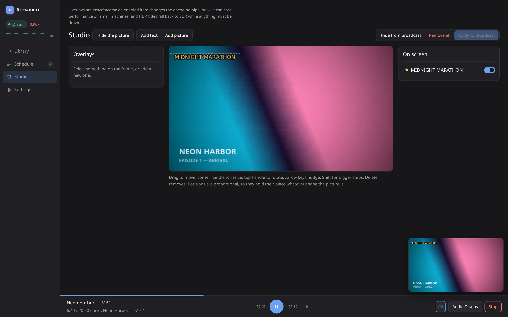

<h1 align="center">Streamerr</h1>
<p align="center">Your media library, running as a live 24/7 channel — with a web panel to drive it.</p>


Streamerr plays the files you already have as one continuous broadcast: queue a
season, and it encodes in real time and publishes over RTMP(S), SRT, or TCP to
any ingest. Subtitles are burned in, audio and subtitle tracks switch
mid-episode, HDR passes through untouched when nothing needs drawing, and a
buffer keeps the stream seamless across episodes, seeks, and track changes.

## Quick start — Docker

```bash
git clone https://github.com/oroshikirin11/Streamerr streamerr && cd streamerr
# edit docker-compose.yml: point the last volume at your media,
# and check the GPU device/group notes in the file
docker compose up -d
```

Open `http://<host>:8099`. The setup wizard covers the rest — password, media
location, metadata, encoder, and where to publish.

- Run Streamerr on the machine that has **direct directory access to the
  media** — that is the preferred setup. If the media lives elsewhere, SMB is
  supported (experimental, slower).
- GPU encoding needs the render node and group from the compose file's
  comments. Without a GPU it encodes in software.

## Quick start — standalone

Node 20+ and ffmpeg 9+ on the PATH.

```bash
git clone https://github.com/oroshikirin11/Streamerr streamerr && cd streamerr
npm install
cd web && npm install && npm run build && cd ..
node src/index.js
```

Open `http://localhost:8099` and run setup.

## Metadata

Two good options, one fallback:

- **Jellyfin** (preferred) — point a library at your Jellyfin server with an
  API key; it already knows your posters and episode order.
- **TMDB** — drop in a free API key and Streamerr matches titles, episode
  names, and posters itself, in the background. Wrong match? Fix it from the
  poster's hover menu.
- Plain filenames work with no key at all; episode stills are generated
  automatically either way.

## The panel

| Schedule | Settings | Studio |
| --- | --- | --- |
|  |  |  |
| What's on air and up next, with projected times | Simple mode: two levers, plus your own saved preset | Overlays positioned on the live frame |

## The receiving end

[Streamingestarr](https://github.com/oroshikirin11/Streamingestarr) is Streamerr's
hybrid ingest service — the stream-receiving counterpart with playback and
chat. Streamerr was first built to publish to
[Owncast](https://owncast.online), which remains fully supported, and any
RTMP/SRT ingest works.

## Features

- Continuous playout over one connection — episode changes, seeks, and track
  switches never drop the stream
- Hardware encoding (VAAPI, QSV, NVENC, AMF, VideoToolbox) with software
  fallback; H.264, HEVC, and AV1 output
- HDR passthrough and tone mapping
- Burned-in subtitles with GPU compositing; audio/subs switchable mid-episode
- Publish to several destinations at once — RTMP(S), SRT, or TCP
- Jellyfin, local folder, and SMB libraries; TMDB or Jellyfin metadata
- Scheduling with projected air times and interval cards for programmed starts
- Studio overlays — text and pictures, dragged into place on the live frame
- Live low-latency preview in the panel; run-ahead RAM cache for instant seeks

## License

[PolyForm Noncommercial 1.0.0](LICENSE.md) — free to use, run, and modify for
any **noncommercial** purpose. Forks are welcome and inherit the same terms.

If Streamerr runs your channel and you want to say thanks:

<a href="https://buymeacoffee.com/oroshikirin11"></a>
